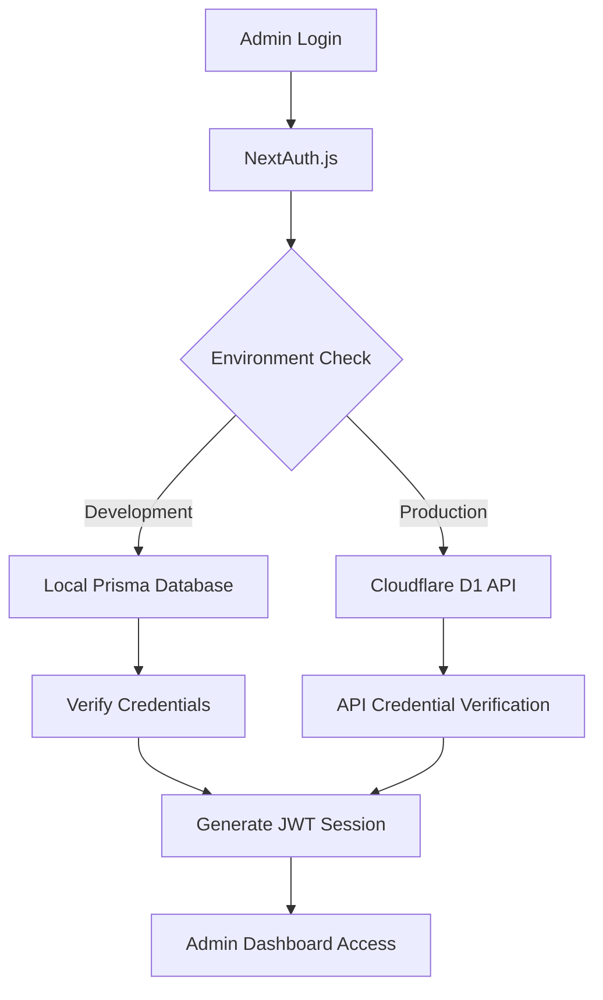

# Admin Panel Guide

This guide covers the complete admin panel functionality, authentication setup, and content management for the portfolio application.

## 🔐 Admin Authentication System

The portfolio uses a sophisticated authentication system that works across both development and production environments.

### Architecture Overview



### Key Features

- **Hybrid Authentication**: Seamlessly switches between local and cloud-based credential verification
- **JWT Sessions**: No database sessions required (solves production authentication issues)
- **Role-Based Access**: Only users with `ADMIN` role can access the admin panel
- **Secure Logout**: Proper session cleanup and redirection
- **Production Ready**: Credentials stored securely in Cloudflare D1 database

## 🚀 Getting Started

### Development Setup

1. **Configure Admin Credentials** in `.env`:

   ```env
   # Admin credentials for development
   ADMIN_EMAIL="admin@example.com"
   ADMIN_PASSWORD="your-secure-password"

   # NextAuth.js configuration
   NEXTAUTH_SECRET="your-nextauth-secret"
   NEXTAUTH_URL="http://localhost:3000"
   ```

2. **Initialize Database**:

   ```bash
   npm run db:generate
   npm run db:migrate
   npm run db:seed
   ```

3. **Start Development Server**:

   ```bash
   npm run dev
   ```

4. **Access Admin Panel**:
   - Navigate to `http://localhost:3000/admin/login`
   - Use credentials from your `.env` file
   - You'll be redirected to the admin dashboard

### Production Setup

1. **Configure Environment Variables** in Vercel:

   ```env
   NEXTAUTH_SECRET=your-production-secret-key
   NEXT_PUBLIC_USE_API=true
   ```

2. **Deploy Cloudflare Backend** (required for production authentication):

   ```bash
   cd cloudflare-api
   wrangler deploy
   ```

3. **Admin Credentials**:
   - Production admin credentials are stored in the Cloudflare D1 database
   - Seeded during backend deployment via `migrations/seed.sql`
   - Passwords are bcrypt hashed for security

4. **Access Production Admin**:
   - Navigate to `https://your-domain.vercel.app/admin/login`
   - Use production admin credentials
   - Authentication is handled via Cloudflare D1 API

## 📊 Admin Dashboard Features

### Dashboard Overview (`/admin`)

The main dashboard provides a comprehensive overview with:

- **Content Statistics**: Quick overview of projects, blog posts, and technologies
- **Quick Actions**: Direct access to create new content
- **System Status**: Health checks and system information
- **Recent Activity**: Latest content updates and changes
- **Navigation Hub**: Quick access to all admin sections

### Core Admin Sections

#### 1. 📝 Content Editor (`/admin/editor`)

- **Purpose**: Advanced rich text content editing and management
- **Features**:
  - Rich text editor with markdown support
  - Real-time preview functionality
  - Image upload and media management
  - SEO meta tags editing
  - Content versioning and drafts
  - Bulk content operations

#### 2. 🗂️ Projects Management (`/admin/projects`)

- **Purpose**: Complete portfolio project CRUD operations
- **Features**:
  - Create, read, update, delete projects
  - Project thumbnail and gallery management
  - Technology stack association
  - Project categories and tagging
  - Visibility controls (draft/published)
  - Project analytics and performance tracking
  - GitHub integration for automatic updates
  - Live demo link management

#### 3. 📰 Blog Management (`/admin/blog`)

- **Purpose**: Full-featured blog content management system
- **Features**:
  - Rich text blog post editor
  - Category and tag management
  - Featured image handling
  - Publication scheduling
  - SEO optimization tools
  - Comment moderation (if enabled)
  - Social media integration
  - Blog analytics and readership metrics

#### 4. 📈 Analytics Dashboard (`/admin/analytics`)

- **Purpose**: Comprehensive site analytics and visitor insights
- **Features**:
  - **Overview Metrics**: Total views, visitors, projects, and blog posts
  - **Views Over Time**: 7-day trend analysis with visual charts
  - **Recent Page Views**: Real-time visitor activity tracking
  - **Popular Projects**: Most viewed projects with engagement metrics
  - **Popular Blog Posts**: Top-performing blog content
  - **Performance Insights**: Page load times and user experience metrics
  - **Export Functionality**: Data export for external analysis
  - **Real-time Updates**: Live analytics with automatic refresh

#### 5. 🛠️ Technologies Management

- **Purpose**: Skills and technology stack management
- **Features**:
  - Add and categorize technologies
  - Skill level management (Beginner → Expert)
  - Project-technology associations
  - Icon and logo management
  - Technology trend tracking
  - Industry category organization

#### 6. 📧 Contact Management

- **Purpose**: Contact form submission and inquiry handling
- **Features**:
  - View and manage contact submissions
  - Response status tracking
  - Email integration for responses
  - Spam filtering and moderation
  - Contact analytics and conversion tracking

#### 7. Database Management

- **Purpose**: Direct database access and management
- **Tool**: Prisma Studio
- **Access**: `npm run db:studio` (development only)
- **Features**:
  - Visual database browser
  - Direct data editing
  - Relationship management
  - Query interface

## 🔧 Authentication Configuration

### NextAuth.js Setup

The authentication system is configured in `/src/lib/auth.ts`:

```typescript
export const authOptions: NextAuthOptions = {
  providers: [
    CredentialsProvider({
      name: 'credentials',
      credentials: {
        email: { label: 'Email', type: 'email' },
        password: { label: 'Password', type: 'password' },
      },
      async authorize(credentials) {
        // Uses hybrid data service for authentication
        const user = await dataService.verifyAdminCredentials(
          credentials.email,
          credentials.password
        )
        // Returns user object or null
      },
    }),
  ],
  session: {
    strategy: 'jwt', // JWT sessions only - no database sessions
  },
  pages: {
    signIn: '/admin/login',
  },
  secret: process.env.NEXTAUTH_SECRET,
}
```

### Key Authentication Features

#### 1. Hybrid Credential Verification

The system automatically chooses the appropriate authentication method:

- **Development**: Local Prisma database lookup
- **Production**: Cloudflare D1 API verification
- **Fallback**: Graceful degradation if API is unavailable

#### 2. JWT Session Management

- **No database sessions**: Eliminates session storage complexity
- **Stateless authentication**: Sessions stored in HTTP-only cookies
- **Automatic expiration**: Configurable session lifetime
- **Secure tokens**: Signed with NEXTAUTH_SECRET

#### 3. Role-Based Authorization

```typescript
// Protected route example
const session = await getServerSession(authOptions)
if (!session || session.user.role !== 'ADMIN') {
  redirect('/admin/login')
}
```

#### 4. Secure Logout

- **Session cleanup**: Removes all authentication cookies
- **Redirect handling**: Returns to homepage after logout
- **Client-side cleanup**: Clears NextAuth.js client state

## 🔒 Security Features

### Authentication Security

1. **Password Hashing**:
   - Uses bcryptjs for password hashing
   - Salt rounds: 12 (configurable)
   - Passwords never stored in plain text

2. **Session Security**:
   - HTTP-only cookies prevent XSS attacks
   - SameSite cookie attribute prevents CSRF
   - Secure flag for HTTPS-only transmission

3. **API Protection**:
   - Bearer token authentication for admin API routes
   - CORS configuration restricts allowed origins
   - Rate limiting on sensitive endpoints

4. **Environment Security**:
   - Sensitive credentials in environment variables
   - Production secrets separate from development
   - No hardcoded credentials in source code

### Authorization Levels

#### Public Access

- Portfolio pages
- Blog articles
- Contact form
- Public API endpoints

#### Admin Access (Role: ADMIN)

- Admin dashboard
- Content editor
- CRUD operations
- Analytics dashboard
- Database management

## 🛠 Troubleshooting

### Common Authentication Issues

#### 1. 401 Authentication Errors (SOLVED)

**Problem**: NextAuth.js authentication failing in production

**Solution Applied**:

- Removed PrismaAdapter from NextAuth configuration
- Using JWT sessions only (`strategy: 'jwt'`)
- Authentication now works through D1 API verification

#### 2. Invalid Credentials Error

**Symptoms**: Login fails with correct credentials

**Solutions**:

- Verify credentials in development `.env` file
- Check if D1 database is properly seeded in production
- Confirm NEXTAUTH_SECRET is set in environment

#### 3. Access Denied Error

**Symptoms**: Login succeeds but admin access denied

**Solutions**:

- Verify user role is set to 'ADMIN' in database
- Check JWT token includes role claim
- Confirm role-based authorization logic

#### 4. Session Not Persisting

**Symptoms**: Logged out after page refresh

**Solutions**:

- Verify NEXTAUTH_SECRET is consistent
- Check cookie settings and HTTPS configuration
- Confirm session strategy is set to 'jwt'

### Development Debugging

1. **Check Database Connection**:

   ```bash
   npm run db:studio
   # Verify admin user exists with correct role
   ```

2. **Test API Endpoints**:

   ```bash
   curl http://localhost:3000/api/auth/session
   curl http://localhost:3000/api/health
   ```

3. **Verify Environment Variables**:
   ```bash
   # Check if required variables are set
   echo $NEXTAUTH_SECRET
   echo $ADMIN_EMAIL
   ```

### Production Debugging

1. **Check Cloudflare D1 Database**:

   ```bash
   wrangler d1 execute portfolio-db --command="SELECT * FROM User WHERE role='ADMIN'"
   ```

2. **Test Cloudflare API**:

   ```bash
   curl https://portfolio-api.your-username.workers.dev/auth/verify \
     -H "Content-Type: application/json" \
     -d '{"email":"admin@example.com","password":"password"}'
   ```

3. **Verify Vercel Environment Variables**:
   - Check Vercel dashboard → Settings → Environment Variables
   - Ensure NEXTAUTH_SECRET is set
   - Confirm NEXT_PUBLIC_USE_API=true

## 📝 Content Management Workflows

### Creating New Projects

1. **Access Admin Dashboard**: Navigate to `/admin`
2. **Use Content Editor**: Click "Open Editor" or visit `/admin/editor`
3. **Add Project**: Use the project creation interface
4. **Set Metadata**: Configure SEO settings, categories, and technologies
5. **Publish**: Change status from DRAFT to PUBLISHED

### Managing Blog Posts

1. **Content Creation**: Use the blog management interface
2. **Category Assignment**: Organize posts by category
3. **Tag Management**: Add relevant tags for discoverability
4. **SEO Optimization**: Set meta titles and descriptions
5. **Publishing Control**: Manage draft and published states

### Technology Stack Management

1. **Add Technologies**: Create new technology entries
2. **Skill Levels**: Set proficiency levels (BEGINNER, INTERMEDIATE, ADVANCED, EXPERT)
3. **Project Association**: Link technologies to specific projects
4. **Category Organization**: Group by frontend, backend, tools, etc.

## 🔄 Data Synchronization

### Development to Production

1. **Export Data**: Use Prisma Studio to export development data
2. **Transform Format**: Convert to SQL format compatible with D1
3. **Deploy to D1**: Use wrangler to execute migration scripts
4. **Verify Sync**: Test data consistency across environments

### Backup and Recovery

1. **Regular Backups**:

   ```bash
   # Development
   sqlite3 prisma/dev.db .dump > backup.sql

   # Production
   wrangler d1 export portfolio-db --output=backup.sql
   ```

2. **Restore Process**:

   ```bash
   # Development
   sqlite3 prisma/dev.db < backup.sql

   # Production
   wrangler d1 execute portfolio-db --file=backup.sql
   ```

## 📊 Analytics and Monitoring

### Built-in Analytics

The admin dashboard includes comprehensive analytics:

1. **Page Views**: Track visits to projects and blog posts
2. **User Behavior**: Monitor engagement patterns
3. **Performance Metrics**: Page load times and Core Web Vitals
4. **Contact Form Analytics**: Submission rates and conversion tracking

### External Analytics Integration

- **Google Analytics**: Page view tracking and user behavior
- **Vercel Analytics**: Performance monitoring and deployment metrics
- **Mixpanel**: Event tracking and user journey analysis

## 🚀 Best Practices

### Security Best Practices

1. **Strong Passwords**: Use complex admin passwords
2. **Regular Updates**: Keep dependencies up to date
3. **Environment Separation**: Different secrets for dev/prod
4. **Access Logging**: Monitor admin login attempts
5. **Regular Backups**: Automated backup procedures

### Content Management Best Practices

1. **SEO Optimization**: Always set meta titles and descriptions
2. **Image Optimization**: Use appropriate image formats and sizes
3. **Content Structure**: Maintain consistent formatting and style
4. **Regular Reviews**: Periodically update outdated content
5. **Performance Monitoring**: Track page load times and user experience

### Development Best Practices

1. **Local Testing**: Always test admin features locally first
2. **Database Migrations**: Use proper migration procedures
3. **Environment Parity**: Keep dev and prod environments similar
4. **Error Handling**: Implement proper error boundaries
5. **Documentation**: Keep admin procedures documented

## 📧 Support and Maintenance

### Regular Maintenance Tasks

1. **Weekly**:
   - Review contact form submissions
   - Check analytics dashboard
   - Monitor error logs

2. **Monthly**:
   - Update content and projects
   - Review and optimize SEO settings
   - Backup database

3. **Quarterly**:
   - Update dependencies
   - Review security settings
   - Performance optimization

### Getting Help

For admin panel issues:

1. **Check this guide** for common solutions
2. **Review logs** in browser console and server logs
3. **Test locally** to isolate environment-specific issues
4. **Verify configuration** - environment variables and settings

---

This admin guide provides comprehensive instructions for managing the portfolio application's backend and content. The admin panel is designed to be user-friendly while maintaining enterprise-level security and functionality.
