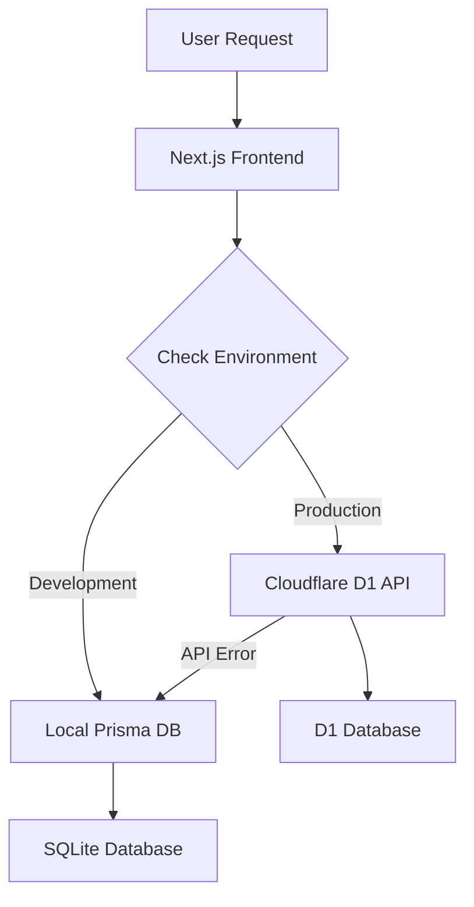

# Portfolio Deployment Guide

This guide covers the complete deployment process for the portfolio application, which uses a hybrid architecture with separate deployments for the frontend (Vercel) and backend API (Cloudflare).

## 🏗 Architecture Overview

The portfolio uses a dual-deployment architecture:

- **Frontend**: Next.js application deployed on Vercel
- **Backend**: Cloudflare Workers API with D1 database
- **Data Flow**: Hybrid service that switches between local Prisma (dev) and Cloudflare D1 API (production)

## 🚀 Quick Start Deployment

### Prerequisites

- GitHub account
- Vercel account
- Cloudflare account
- Node.js 18+
- Git CLI

### Step 1: Deploy Cloudflare Backend (Required for Production)

First, deploy the Cloudflare Workers API that powers the production database:

1. **Navigate to the API directory**:

   ```bash
   cd cloudflare-api
   ```

2. **Install Wrangler CLI** (if not already installed):

   ```bash
   npm install -g wrangler@latest
   ```

3. **Authenticate with Cloudflare**:

   ```bash
   wrangler auth login
   ```

4. **Create D1 Database**:

   ```bash
   wrangler d1 create portfolio-db
   ```

   Save the database ID from the output and update `wrangler.toml`:

   ```toml
   [[d1_databases]]
   binding = "DB"
   database_name = "portfolio-db"
   database_id = "your-database-id-here"
   ```

5. **Deploy database schema**:

   ```bash
   wrangler d1 execute portfolio-db --file=migrations/schema.sql
   wrangler d1 execute portfolio-db --file=migrations/seed.sql
   ```

6. **Deploy the Worker**:

   ```bash
   wrangler deploy
   ```

   Note the Worker URL (e.g., `https://portfolio-api.your-username.workers.dev`)

### Step 2: Deploy Frontend to Vercel

1. **Push to GitHub**:

   ```bash
   git add .
   git commit -m "Ready for deployment"
   git push origin main
   ```

2. **Import to Vercel**:
   - Go to [vercel.com](https://vercel.com)
   - Click "New Project"
   - Import your GitHub repository
   - Vercel will auto-detect Next.js settings

3. **Configure Environment Variables** in Vercel dashboard:

   **Required Variables**:

   ```env
   NEXTAUTH_SECRET=your-secure-random-secret-key-here
   NEXT_PUBLIC_USE_API=true
   ```

   **Optional Variables**:

   ```env
   API_SECRET=portfolio-api-secret-2024
   NEXT_PUBLIC_API_URL=https://portfolio-api.your-username.workers.dev
   OPENAI_API_KEY=sk-your-openai-key
   RESEND_API_KEY=re_your-resend-key
   CONTACT_EMAIL=your-email@example.com
   ```

4. **Deploy**:
   - Click "Deploy"
   - Vercel will build and deploy automatically

## 🔧 Detailed Configuration

### Frontend Environment Variables

Copy these to your Vercel dashboard under Project Settings → Environment Variables:

#### Production Environment Variables (.env.production)

```env
# Authentication (Required)
NEXTAUTH_SECRET=your-nextauth-secret-key-here

# API Configuration (Required for production)
NEXT_PUBLIC_USE_API=true

# Optional: Override default API URL
NEXT_PUBLIC_API_URL=https://portfolio-api.your-username.workers.dev

# Optional: API secret for admin operations
API_SECRET=portfolio-api-secret-2024

# Optional: Contact form
RESEND_API_KEY=re_your-resend-key
CONTACT_EMAIL=your-email@example.com

# Optional: AI features
OPENAI_API_KEY=sk-your-openai-key

# Optional: Analytics
GOOGLE_ANALYTICS_ID=your-ga-id
MIXPANEL_TOKEN=your-mixpanel-token
VERCEL_ANALYTICS_ID=your-vercel-analytics-id
```

### Backend Configuration (Cloudflare)

The `wrangler.toml` file configures the Cloudflare Worker:

```toml
name = "portfolio-api"
main = "src/index.ts"
compatibility_date = "2024-01-01"

[[d1_databases]]
binding = "DB"
database_name = "portfolio-db"
database_id = "your-database-id-here"

[vars]
CORS_ORIGIN = "https://your-vercel-app.vercel.app"
API_SECRET = "portfolio-api-secret-2024"

[env.development]
[env.development.vars]
CORS_ORIGIN = "http://localhost:3000"
```

## 🌐 Environment-Specific Deployment

### Development Environment

For local development, the app uses:

- Local SQLite database via Prisma
- NextAuth.js with local credentials
- Optional API testing with `NEXT_PUBLIC_USE_API=true`

```bash
# Local development setup
npm install
cp .env.example .env
npm run db:generate
npm run db:migrate
npm run db:seed
npm run dev
```

### Production Environment

Production automatically uses:

- Cloudflare D1 database via Workers API
- NextAuth.js with JWT sessions (no database adapter)
- Hybrid data service with API-first approach

## 🔒 Authentication Setup

### Production Admin Access

Admin authentication in production works through the Cloudflare D1 database:

1. **Admin credentials are stored in the D1 database** (seeded during deployment)
2. **NextAuth.js uses JWT sessions** (no database adapter required)
3. **Authentication flow**:
   - User enters credentials at `/admin/login`
   - Credentials verified against D1 database via API
   - JWT session created and stored in cookies
   - Admin access granted to `/admin` routes

### Important Authentication Notes

- **No Prisma adapter** in production (solved 401 authentication errors)
- **JWT sessions only** - no database sessions required
- **Secure credentials** - stored securely in D1 database
- **Automatic logout** - proper session management implemented

## 📊 Monitoring & Health Checks

### Health Check Endpoints

- **Frontend health**: `https://your-app.vercel.app/api/health`
- **Backend health**: `https://portfolio-api.your-username.workers.dev/`

### Monitoring Production

1. **Vercel Dashboard**: Monitor frontend deployment and performance
2. **Cloudflare Dashboard**: Monitor Workers analytics and D1 database
3. **Application Logs**: Check both Vercel and Cloudflare logs for issues

## 🔄 Data Service Architecture

### How the Hybrid System Works



**DataService Logic**:

```typescript
constructor() {
  // Use API in production OR when explicitly enabled
  this.useApi = !isDevelopment || USE_API
}
```

**Benefits**:

- **Development**: Fast local database, offline development
- **Production**: Scalable cloud database, global edge deployment
- **Reliability**: Automatic fallback to local database if API fails
- **Type Safety**: Consistent data types across environments

## 🚀 Deployment Scripts

### Automated Build Process

The application uses a custom build script (`scripts/build.sh`) that:

1. **Excludes Cloudflare API** from Next.js bundle
2. **Generates Prisma client** for local fallback
3. **Optimizes for Vercel deployment**

```bash
# Build command (automatically run by Vercel)
npm run build
```

### Manual Deployment Commands

```bash
# Frontend deployment (Vercel)
git push origin main  # Triggers automatic deployment

# Backend deployment (Cloudflare)
cd cloudflare-api
wrangler deploy

# Database migrations (if schema changes)
wrangler d1 execute portfolio-db --file=migrations/schema.sql
```

## 🛠 Troubleshooting

### Common Issues

#### 1. 401 Authentication Errors (SOLVED)

**Problem**: NextAuth.js authentication failing in production

**Solution**:

- Removed PrismaAdapter from NextAuth configuration
- Using JWT sessions only (`strategy: 'jwt'`)
- Authentication now works through D1 API verification

#### 2. Build Errors with Cloudflare API

**Problem**: Next.js trying to bundle Cloudflare Workers code

**Solution**:

- Added `cloudflare-api` to build exclusions
- Custom build script prevents bundling conflicts

#### 3. Database Connection Issues

**Problem**: Cannot connect to D1 database

**Solutions**:

- Verify D1 database ID in `wrangler.toml`
- Check CORS settings for your Vercel domain
- Ensure API_SECRET matches between environments

#### 4. Environment Variables Not Working

**Problem**: Environment variables not being read

**Solutions**:

- Double-check variable names (no typos)
- Ensure `NEXT_PUBLIC_` prefix for client-side variables
- Restart Vercel deployment after adding variables

### Debugging Steps

1. **Check deployment logs**:
   - Vercel: Project dashboard → Deployments → View logs
   - Cloudflare: Workers dashboard → View logs

2. **Test API endpoints**:

   ```bash
   curl https://portfolio-api.your-username.workers.dev/
   curl https://your-app.vercel.app/api/health
   ```

3. **Verify environment variables**:
   - Check Vercel dashboard → Settings → Environment Variables
   - Check Cloudflare dashboard → Workers → Settings

## 📈 Performance Optimization

### Frontend Optimizations

- **Next.js 15** with App Router and React 19 features
- **Turbopack** for faster development builds
- **Image optimization** with Next.js Image component
- **Bundle optimization** excluding unused dependencies

### Backend Optimizations

- **Edge deployment** with Cloudflare Workers
- **Global CDN** for API responses
- **D1 database** optimized for read operations
- **Efficient queries** with proper indexing

## 🔄 Updates & Maintenance

### Regular Maintenance Tasks

1. **Update dependencies**:

   ```bash
   npm update
   cd cloudflare-api && npm update
   ```

2. **Monitor security updates**:
   - Check GitHub Dependabot alerts
   - Update NextAuth.js and other security-critical packages

3. **Database maintenance**:
   - Monitor D1 database usage
   - Backup important data regularly

### Version Updates

- **Frontend**: Automatic deployment on GitHub push
- **Backend**: Manual deployment with `wrangler deploy`
- **Database**: Manual migration with schema changes

## 📧 Support

### Getting Help

For deployment issues:

1. **Check this guide** for common solutions
2. **Review logs** in Vercel and Cloudflare dashboards
3. **Verify configuration** - environment variables and settings
4. **Test locally** to isolate the issue

### Contact

For complex issues, create a GitHub issue with:

- Deployment logs
- Environment configuration (without secrets)
- Steps to reproduce the problem

---

This deployment guide ensures a successful launch of your portfolio with all features working correctly across both development and production environments.
