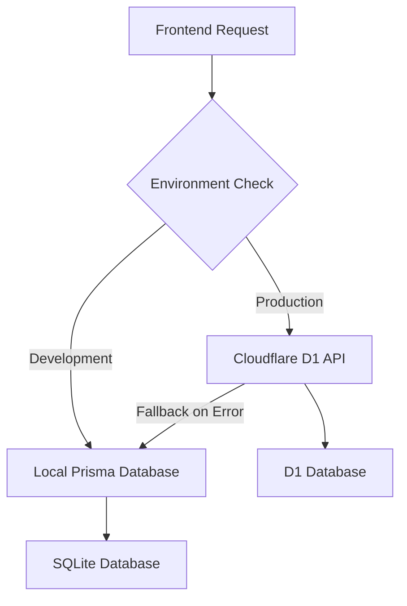

# Lukas Hosala - Portfolio Website

A modern, full-stack portfolio application built with Next.js 15 and a hybrid data architecture supporting both local development and cloud-based production deployment.

## 🏗 Architecture Overview

This portfolio uses a sophisticated hybrid architecture that seamlessly switches between local development and production environments:

### Frontend (Next.js 15.5.3)

- **Framework**: Next.js with App Router and TypeScript
- **Styling**: Tailwind CSS 4 with Radix UI components
- **Authentication**: NextAuth.js with JWT sessions (no database adapter required)
- **Deployment**: Vercel platform

### Backend & Database

- **Development**: Local SQLite database via Prisma ORM
- **Production**: Cloudflare D1 database via Workers API
- **API**: Cloudflare Workers with Hono framework
- **Data Service**: Hybrid service that automatically switches between local Prisma and D1 API

### Key Features

- **Admin Authentication**: Secure credentials-based authentication system
- **Content Management**: Full CRUD operations for projects and blog posts
- **Hybrid Data Layer**: Automatic fallback between cloud API and local database
- **Type Safety**: End-to-end TypeScript implementation
- **Performance**: Optimized build system with proper external exclusions

## 🚀 Quick Start

### Prerequisites

- Node.js 18+
- npm or yarn
- Git

### Installation

1. **Clone the repository**

   ```bash
   git clone <repository-url>
   cd portfolio-by-lukas
   ```

2. **Install dependencies**

   ```bash
   npm install
   ```

3. **Set up environment variables**

   ```bash
   cp .env.example .env
   ```

   Edit `.env` with your configuration:

   ```env
   # Database (for local development)
   DATABASE_URL="file:./dev.db"

   # NextAuth.js (Required for admin access)
   NEXTAUTH_URL="http://localhost:3000"
   NEXTAUTH_SECRET="your-nextauth-secret-here"

   # Admin Credentials (Required)
   ADMIN_EMAIL="admin@example.com"
   ADMIN_PASSWORD="admin123"

   # Optional: API configuration for D1 testing
   NEXT_PUBLIC_API_URL="https://portfolio-api.your-username.workers.dev"
   API_SECRET="your-cloudflare-worker-api-secret"
   ```

4. **Initialize the database**

   ```bash
   npm run db:generate
   npm run db:migrate
   npm run db:seed
   ```

5. **Start development server**
   ```bash
   npm run dev
   ```

Visit [http://localhost:3000](http://localhost:3000) to see your portfolio.

## 🔐 Admin Access

### Local Development

- Navigate to `/admin/login`
- Use credentials from your `.env` file
- Access admin dashboard at `/admin`
- Content editor available at `/admin/editor`

### Production

- Set `NEXT_PUBLIC_USE_API=true` in production environment
- Admin credentials are managed through the Cloudflare D1 database
- Authentication uses JWT sessions (no database sessions required)

## 🛠 Development

### Available Scripts

```bash
# Development
npm run dev              # Start dev server with Turbopack
npm run build           # Build for production (runs custom build script)
npm run start           # Start production server

# Database (Local)
npm run db:generate     # Generate Prisma client
npm run db:migrate      # Run database migrations
npm run db:seed         # Seed database with sample data
npm run db:studio       # Open Prisma Studio
npm run db:reset        # Reset and reseed database

# Code Quality
npm run lint            # Run ESLint
npm run lint:fix        # Fix ESLint issues
npm run format          # Format code with Prettier
npm run type-check      # Run TypeScript checks

# Testing
npm run test:e2e        # Run Playwright E2E tests
```

### Project Structure

```
├── src/
│   ├── app/                    # Next.js App Router pages
│   │   ├── admin/             # Admin panel and authentication
│   │   ├── api/               # API routes (NextAuth, health checks)
│   │   └── (public)/          # Public pages (portfolio, blog)
│   ├── components/            # Reusable UI components
│   ├── lib/                   # Core utilities and services
│   │   ├── auth.ts           # NextAuth configuration
│   │   ├── data-service.ts   # Hybrid data service
│   │   ├── api-client.ts     # Cloudflare D1 API client
│   │   └── prisma.ts         # Prisma client
│   └── types/                 # TypeScript type definitions
├── cloudflare-api/            # Cloudflare Workers API
│   ├── src/                   # Worker source code
│   ├── migrations/            # D1 database migrations
│   └── wrangler.toml         # Cloudflare configuration
├── prisma/                    # Local database schema and migrations
└── scripts/                   # Build and deployment scripts
```

## 🌐 Environment Configuration

### Development Environment

- Uses local SQLite database via Prisma
- Optional D1 API testing with `NEXT_PUBLIC_USE_API=true`
- Admin authentication via local database

### Production Environment

- Uses Cloudflare D1 database exclusively
- NextAuth.js with JWT sessions (no database adapter)
- Environment variables configured in Vercel dashboard

### Required Environment Variables

**Development (.env)**:

```env
DATABASE_URL="file:./dev.db"
NEXTAUTH_SECRET="your-nextauth-secret"
ADMIN_EMAIL="admin@example.com"
ADMIN_PASSWORD="admin123"
```

**Production (Vercel)**:

```env
NEXTAUTH_SECRET="your-production-secret"
NEXT_PUBLIC_USE_API="true"
API_SECRET="portfolio-api-secret-2024"
```

## 📚 Key Technologies

### Frontend Stack

- **Next.js 15.5.3**: Latest features including App Router and React 19 support
- **TypeScript 5**: Full type safety across the application
- **Tailwind CSS 4**: Latest version with improved performance
- **Radix UI**: Accessible, customizable component primitives
- **NextAuth.js 4**: Authentication with JWT sessions

### Backend Stack

- **Cloudflare Workers**: Serverless API endpoints
- **Hono Framework**: Fast, lightweight web framework for Workers
- **Cloudflare D1**: Serverless SQLite database
- **Prisma ORM**: Type-safe database client for local development

### Development Tools

- **ESLint 9**: Latest linting configuration
- **Prettier**: Code formatting
- **Husky**: Git hooks for code quality
- **Playwright**: End-to-end testing
- **Wrangler 4**: Cloudflare development CLI

## 🔄 Data Flow

### Hybrid Data Service Architecture



The `DataService` class automatically determines whether to use:

1. **Cloudflare D1 API** (production environment or when `NEXT_PUBLIC_USE_API=true`)
2. **Local Prisma database** (development environment or API fallback)

This architecture ensures:

- **Development flexibility**: Work offline with local database
- **Production reliability**: Cloud-hosted database with proper scaling
- **Graceful degradation**: Automatic fallback to local database if API fails
- **Type safety**: Consistent data types across both environments

## 🚀 Deployment

See [DEPLOYMENT.md](./DEPLOYMENT.md) for detailed deployment instructions for both Vercel (frontend) and Cloudflare (backend API).

## 📖 Additional Documentation

- [DEPLOYMENT.md](./DEPLOYMENT.md) - Comprehensive deployment guide
- [API.md](./API.md) - Cloudflare Workers API documentation
- [ADMIN.md](./ADMIN.md) - Admin panel usage and setup guide

## 🤝 Contributing

1. Fork the repository
2. Create a feature branch: `git checkout -b feature/amazing-feature`
3. Commit your changes: `git commit -m 'Add amazing feature'`
4. Push to the branch: `git push origin feature/amazing-feature`
5. Open a Pull Request

## 📧 Support

For questions or support, please open an issue in the GitHub repository.

## 📄 License

This project is licensed under the MIT License - see the LICENSE file for details.
