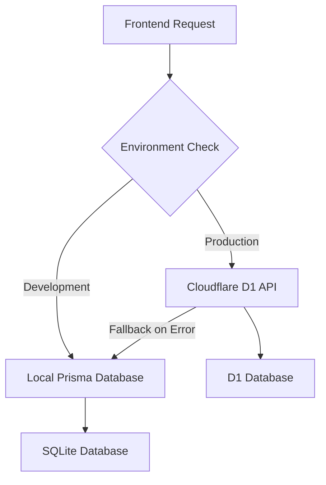

# Lukas Hosala - Portfolio Website

A modern, full-stack portfolio application built with Next.js 15 and a hybrid data architecture supporting both local development and cloud-based production deployment.

## 🏗 Architecture Overview

This portfolio uses a sophisticated hybrid architecture that seamlessly switches between local development and production environments:

### Frontend (Next.js 15.5.3)

- **Framework**: Next.js with App Router and TypeScript
- **Styling**: Tailwind CSS 4 with Radix UI components
- **Authentication**: NextAuth.js with JWT sessions (no database adapter required)
- **Deployment**: Vercel platform

### Backend & Database

- **Development**: Local SQLite database via Prisma ORM
- **Production**: Cloudflare D1 database via Workers API
- **API**: Cloudflare Workers with Hono framework
- **Data Service**: Hybrid service that automatically switches between local Prisma and D1 API

### Key Features

#### 🎨 **Portfolio Features**

- **Modern Portfolio Design**: Responsive, professional portfolio showcase
- **Interactive Project Gallery**: Dynamic project carousel with detailed project pages
- **Professional About Page**: Comprehensive background, experience, and skills
- **Contact Integration**: Contact form with email integration via Nodemailer/Resend
- **Blog System**: Full-featured blog with rich content management
- **Skills Showcase**: Comprehensive technology and skills display

#### 🔐 **Admin Panel**

- **Secure Authentication**: JWT-based authentication with NextAuth.js
- **Content Management System**: Full CRUD operations for projects and blog posts
- **Rich Text Editor**: Advanced content editor for blog posts and project descriptions
- **Analytics Dashboard**: Built-in analytics with visitor tracking and engagement metrics
- **Media Management**: File upload and management system
- **Real-time Preview**: Live preview of content changes

#### 🤖 **AI & Analytics**

- **AI-Powered Chatbot**: Integrated OpenAI chatbot for visitor interaction
- **Performance Monitoring**: Real-time performance tracking and optimization
- **Analytics Provider**: Custom analytics with Mixpanel integration
- **SEO Optimization**: Comprehensive meta tags and search engine optimization

#### 🏗️ **Technical Features**

- **Hybrid Data Architecture**: Seamless switching between local SQLite and Cloudflare D1
- **Type Safety**: End-to-end TypeScript implementation with full type coverage
- **Modern Stack**: Next.js 15, React 19, Tailwind CSS 4, and Radix UI
- **Performance Optimized**: Turbopack, dynamic imports, and optimal bundle splitting
- **Testing Framework**: Playwright E2E testing setup
- **Code Quality**: ESLint 9, Prettier, Husky git hooks, and lint-staged

## 🚀 Quick Start

### Prerequisites

- Node.js 18+
- npm or yarn
- Git

### Installation

1. **Clone the repository**

   ```bash
   git clone <repository-url>
   cd portfolio-by-lukas
   ```

2. **Install dependencies**

   ```bash
   npm install
   ```

3. **Set up environment variables**

   ```bash
   cp .env.example .env
   ```

   Edit `.env` with your configuration:

   ```env
   # Database (for local development)
   DATABASE_URL="file:./dev.db"

   # NextAuth.js (Required for admin access)
   NEXTAUTH_URL="http://localhost:3000"
   NEXTAUTH_SECRET="your-nextauth-secret-here"

   # Admin Credentials (Required)
   ADMIN_EMAIL="admin@example.com"
   ADMIN_PASSWORD="admin123"

   # AI Features (Optional)
   OPENAI_API_KEY="your-openai-api-key"

   # Email Services (Optional)
   RESEND_API_KEY="your-resend-api-key"
   SMTP_HOST="smtp.gmail.com"
   SMTP_PORT="587"
   SMTP_USER="your-email@gmail.com"
   SMTP_PASS="your-app-password"

   # Analytics (Optional)
   MIXPANEL_TOKEN="your-mixpanel-token"
   NEXT_PUBLIC_MIXPANEL_TOKEN="your-public-mixpanel-token"

   # API Configuration (Optional - for D1 testing)
   NEXT_PUBLIC_API_URL="https://portfolio-api.your-username.workers.dev"
   API_SECRET="your-cloudflare-worker-api-secret"
   ```

4. **Initialize the database**

   ```bash
   npm run db:generate
   npm run db:migrate
   npm run db:seed
   ```

5. **Start development server**
   ```bash
   npm run dev
   ```

Visit [http://localhost:3000](http://localhost:3000) to see your portfolio.

## 🔐 Admin Access

### Local Development

- Navigate to `/admin/login`
- Use credentials from your `.env` file:
  - **Email**: `admin@example.com`
  - **Password**: `admin123`

### Admin Panel Features

Once logged in, you have access to:

- **📊 Dashboard** (`/admin`) - Overview with content statistics and quick actions
- **📝 Content Editor** (`/admin/editor`) - Rich text editor for creating/editing content
- **🗂️ Project Management** (`/admin/projects`) - Full CRUD operations for portfolio projects
- **📰 Blog Management** (`/admin/blog`) - Complete blog post management system
- **📈 Analytics Dashboard** (`/admin/analytics`) - View engagement metrics and visitor statistics

### Production

- Set `NEXT_PUBLIC_USE_API=true` in production environment
- Admin credentials are managed through the Cloudflare D1 database
- Authentication uses JWT sessions (no database sessions required)
- All admin features work seamlessly with cloud infrastructure

## 🛠 Development

### Available Scripts

```bash
# Development
npm run dev              # Start dev server with Turbopack
npm run build           # Build for production (runs custom build script)
npm run start           # Start production server

# Database (Local)
npm run db:generate     # Generate Prisma client
npm run db:migrate      # Run database migrations
npm run db:seed         # Seed database with sample data
npm run db:studio       # Open Prisma Studio
npm run db:reset        # Reset and reseed database

# Code Quality
npm run lint            # Run ESLint
npm run lint:fix        # Fix ESLint issues
npm run format          # Format code with Prettier
npm run type-check      # Run TypeScript checks

# Testing
npm run test:e2e        # Run Playwright E2E tests
npm run test:e2e:ui     # Run Playwright tests with UI
npm run test:e2e:headed # Run Playwright tests in headed mode

# Production Database
npm run db:init-production # Initialize production database
```

### Project Structure

```
├── src/
│   ├── app/                    # Next.js App Router pages
│   │   ├── admin/             # Admin panel and authentication
│   │   │   ├── analytics/     # Analytics dashboard
│   │   │   ├── blog/          # Blog management
│   │   │   ├── editor/        # Content editor
│   │   │   ├── login/         # Authentication
│   │   │   └── projects/      # Project management
│   │   ├── api/               # API routes
│   │   │   └── auth/          # NextAuth endpoints
│   │   ├── about/             # About page
│   │   ├── blog/              # Blog listing
│   │   ├── contact/           # Contact page
│   │   ├── skills/            # Skills showcase
│   │   └── work/              # Work experience
│   ├── components/            # Reusable UI components
│   │   ├── ui/                # Radix UI components
│   │   ├── admin/             # Admin-specific components
│   │   ├── ai-chatbot.tsx     # OpenAI chatbot integration
│   │   ├── analytics-dashboard.tsx  # Analytics components
│   │   └── performance-monitor.tsx  # Performance tracking
│   ├── lib/                   # Core utilities and services
│   │   ├── auth.ts           # NextAuth configuration
│   │   ├── data-service.ts   # Hybrid data service
│   │   ├── api-client.ts     # Cloudflare D1 API client
│   │   ├── prisma.ts         # Prisma client
│   │   ├── personalization.ts # User personalization
│   │   ├── seo.ts            # SEO utilities
│   │   └── d1-client.ts      # D1 database client
│   ├── generated/             # Generated Prisma client
│   └── types/                 # TypeScript type definitions
├── cloudflare-api/            # Cloudflare Workers API
│   ├── src/                   # Worker source code
│   ├── migrations/            # D1 database migrations
│   └── wrangler.toml         # Cloudflare configuration
├── prisma/                    # Local database schema and migrations
├── scripts/                   # Build and deployment scripts
├── tests/                     # Playwright E2E tests
└── .github/                   # GitHub workflows and templates
```

## 🌐 Environment Configuration

### Development Environment

- Uses local SQLite database via Prisma
- Optional D1 API testing with `NEXT_PUBLIC_USE_API=true`
- Admin authentication via local database

### Production Environment

- Uses Cloudflare D1 database exclusively
- NextAuth.js with JWT sessions (no database adapter)
- Environment variables configured in Vercel dashboard

### Required Environment Variables

**Development (.env)**:

```env
DATABASE_URL="file:./dev.db"
NEXTAUTH_SECRET="your-nextauth-secret"
ADMIN_EMAIL="admin@example.com"
ADMIN_PASSWORD="admin123"
```

**Production (Vercel)**:

```env
NEXTAUTH_SECRET="your-production-secret"
NEXT_PUBLIC_USE_API="true"
API_SECRET="portfolio-api-secret-2024"
```

## 📚 Key Technologies

### Frontend Stack

- **Next.js 15.5.3**: Latest features including App Router and React 19 support
- **React 19.1.0**: Latest React with concurrent features and improved performance
- **TypeScript 5**: Full type safety across the application with strict mode
- **Tailwind CSS 4**: Latest version with improved performance and new features
- **Radix UI**: Accessible, customizable component primitives (Dialog, Tabs, Progress, etc.)
- **NextAuth.js 4**: Authentication with JWT sessions and credentials provider
- **Lucide React**: Modern icon library with 500+ icons
- **React Hook Form**: Performant forms with minimal re-renders
- **Zod**: TypeScript-first schema validation

### Backend Stack

- **Cloudflare Workers**: Serverless API endpoints with global edge distribution
- **Hono Framework**: Fast, lightweight web framework for Workers
- **Cloudflare D1**: Serverless SQLite database with automatic backups
- **Prisma ORM**: Type-safe database client for local development with migrations
- **bcryptjs**: Password hashing for secure authentication
- **Nodemailer/Resend**: Email services for contact forms and notifications
- **Rate Limiting**: Request rate limiting with rate-limiter-flexible

### Development Tools

- **ESLint 9**: Latest linting configuration with Next.js rules
- **Prettier**: Code formatting with custom configuration
- **Husky**: Git hooks for code quality enforcement
- **lint-staged**: Run linters on git staged files
- **Playwright**: End-to-end testing framework with UI mode
- **Wrangler 4**: Cloudflare development CLI for Workers and D1
- **tsx**: TypeScript execution engine for scripts
- **Turbopack**: Next.js bundler for faster development builds

### Integrations & APIs

- **OpenAI API**: GPT integration for AI chatbot functionality
- **Mixpanel**: Advanced analytics and user behavior tracking
- **Vercel Analytics**: Performance and visitor analytics
- **Resend/Nodemailer**: Email delivery services
- **UA Parser**: User agent parsing for device detection

## 🔄 Data Flow

### Hybrid Data Service Architecture



The `DataService` class automatically determines whether to use:

1. **Cloudflare D1 API** (production environment or when `NEXT_PUBLIC_USE_API=true`)
2. **Local Prisma database** (development environment or API fallback)

This architecture ensures:

- **Development flexibility**: Work offline with local database
- **Production reliability**: Cloud-hosted database with proper scaling
- **Graceful degradation**: Automatic fallback to local database if API fails
- **Type safety**: Consistent data types across both environments

## 🚀 Deployment

See [DEPLOYMENT.md](./DEPLOYMENT.md) for detailed deployment instructions for both Vercel (frontend) and Cloudflare (backend API).

## 📖 Additional Documentation

### Core Documentation

- [FEATURES.md](./FEATURES.md) - Comprehensive feature documentation
- [ADMIN.md](./ADMIN.md) - Admin panel usage and setup guide
- [API.md](./API.md) - Cloudflare Workers API documentation
- [DEPLOYMENT.md](./DEPLOYMENT.md) - Comprehensive deployment guide

### Setup & Configuration Guides

- [AI_FEATURES_SETUP.md](./AI_FEATURES_SETUP.md) - OpenAI chatbot and AI feature setup
- [BACKEND_SETUP.md](./BACKEND_SETUP.md) - Cloudflare Workers backend configuration
- [PRODUCTION_SETUP.md](./PRODUCTION_SETUP.md) - Production environment setup
- [DEPLOYMENT_GUIDE.md](./DEPLOYMENT_GUIDE.md) - Step-by-step deployment instructions

### Technical Documentation

- [BUILD_FIX.md](./BUILD_FIX.md) - Build issues and solutions
- [scripts/setup-d1.md](./scripts/setup-d1.md) - D1 database setup instructions

## 🤝 Contributing

1. Fork the repository
2. Create a feature branch: `git checkout -b feature/amazing-feature`
3. Commit your changes: `git commit -m 'Add amazing feature'`
4. Push to the branch: `git push origin feature/amazing-feature`
5. Open a Pull Request

## 📧 Support

For questions or support, please open an issue in the GitHub repository.

## 📄 License

This project is licensed under the MIT License - see the LICENSE file for details.
